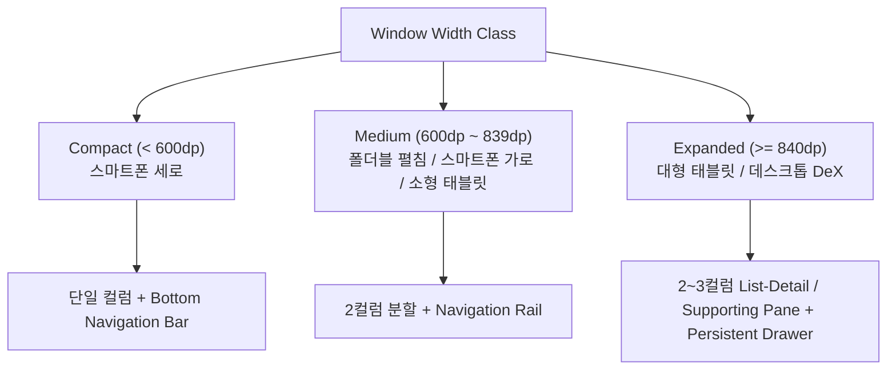

# 테이스트 아카이브 종합 Design System & UX 가이드라인

> **문서 상태**: Draft (디자이너 부서 심층 연구 및 표준 규격 산출물)  
> **문서 위치**: `app/docs/departments/designer/design-system-ux-research.md`  
> **참조 표준**: Android Material 3 Adaptive Layouts, WindowSizeClass, W3C Design Tokens, Figma UX Guide, WCAG 2.1 AAA/AA, Pure Design System Principles

---

## 1. 개요 및 설계 철학

테이스트 아카이브(DrinkDiary)의 디자인 시스템은 기능 종속적인 비즈니스 로직과 분리된 **순수 디자인 파운데이션 및 인터랙션 표준(Pure Design Principles)**을 확립하여, 향후 기능이 확장되거나 변경되더라도 시각적 일관성과 높은 완성도를 지속적으로 유지하는 것을 목표로 합니다.

---

## 2. 순수 디자인 시스템 원칙 (Pure Design Do & Don't)

특정 기능에 종속되지 않고, 앱 전체 화면과 UI 컴포넌트 설계 시 엄격히 준수해야 하는 **6대 시각 디자인 원칙**입니다.

### 2.1 색상 배합 및 조화 (Color Harmony)

| 항목 | ✅ DO (권장) | ❌ DON'T (금지) |
| :--- | :--- | :--- |
| **액센트 절제** | **한 화면(Viewport) 내 액센트 컬러 최대 2개로 제한** (Primary Green 1종 + 주종 포인트 1종. 60-30-10 법칙: 배경 60%, 중립 서피스 30%, 액센트 10%) | **3가지 이상의 원색을 한 화면에 혼용 금지** (한 화면에 빨강, 파랑, 노랑, 초록 등 다채색 버튼/뱃지를 동시에 배치하여 시각적 소음 유발 금지) |
| **시맨틱 토큰** | **모든 색상은 의미 기반 시맨틱 토큰(`color.surface`, `color.action.primary`)으로만 참조** | **코드 내에 임의의 Hex 값(예: `#4A90E2`) 하드코딩 금지** (테마 변경 시 깨짐 및 유지보수 불가능 초래) |

### 2.2 다크/라이트 테마 및 시인성 (Theme & Contrast)

| 항목 | ✅ DO (권장) | ❌ DON'T (금지) |
| :--- | :--- | :--- |
| **명도 대비** | **WCAG 2.1 기준 본문 7.0:1 (AAA), 보조 텍스트 4.5:1 (AA) 대비 보장** (Light와 Dark 모드 모두에서 배경과 텍스트의 선명한 가독성 확보) | **Dark 모드에서 채도 100% 원색/네온 텍스트 사용 금지** (어두운 배경 위 과포화 원색은 눈부심(Halation)과 심각한 시각 피로를 유발함) |
| **다크 표면 톤** | **완전한 블랙(`#000000`) 대신 깊이감 있는 웜 다크 톤(`#15110E`, `#221C17`) 사용** | **다크 모드를 단순히 반전(Invert)하여 처리 금지** (색상의 시각적 무게감이 무너지고 명도 계층이 왜곡됨) |

### 2.3 타이포그래피 및 서체 위계 (Typography & Scale)

| 항목 | ✅ DO (권장) | ❌ DON'T (금지) |
| :--- | :--- | :--- |
| **폰트 조합** | **앱 전체에서 서체는 최대 2종(Serif 1종 + Sans 1종)으로 제한** (브랜드/코드용 Serif, 가독성/UI용 Sans) | **한 화면에 3종 이상의 이종 서체를 섞어 쓰기 금지** (필기체, 장식체, 디스플레이 서체를 무분별하게 혼용 금지) |
| **행간과 자간** | **본문 텍스트는 폰트 크기 대비 140~150%의 행간(Line-Height)과 적정 자간 적용** | **자간(Tracking) 보정 없이 거대 텍스트(Huge Untracked Typeface) 남발 금지** |

### 2.4 아이콘 및 그래픽 에셋 무결성 (Iconography & Assets)

| 항목 | ✅ DO (권장) | ❌ DON'T (금지) |
| :--- | :--- | :--- |
| **에셋 제작 통일** | **모든 아이콘은 통일된 24×24dp 그리드, 2dp 선 굵기, 동일 코너 곡률로 자체 제작/규격화** | **웹이나 외부에서 무작위로 아이콘을 개별 다운로드하여 혼용 금지** (선 굵기가 다르거나 채움형/선형 아이콘이 뒤섞여 조악해지는 현상 방지) |
| **벡터 포맷** | **모든 UI 그래픽은 해상도 독립적인 Vector Drawable (SVG/XML)로 제공** | **아이콘/UI 요소에 저해상도 래스터 이미지(PNG/JPG) 사용 금지** |

### 2.5 터치 타깃 및 공간 여백 (Touch Target & Spacing)

| 항목 | ✅ DO (권장) | ❌ DON'T (금지) |
| :--- | :--- | :--- |
| **접근성 타깃** | **모든 버튼, 칩, 인터랙티브 요소는 최소 48×48dp 터치 영역 보장** | **손가락으로 탭하기 어려운 36dp 미만의 작은 터치 영역 배치 금지** |
| **8dp 그리드** | **모든 여백과 간격은 4dp/8dp 배수 토큰(`4`, `8`, `12`, `16`, `24`, `32dp`)만 사용** | **임의의 비표준 dp 값(`7dp`, `13dp`, `19dp` 등)을 화면마다 흩뿌려 배치 금지** |

### 2.6 표면 장식 및 깊이감 절제 (Decoration & Depth)

| 항목 | ✅ DO (권장) | ❌ DON'T (금지) |
| :--- | :--- | :--- |
| **절제된 보더** | **1px의 단정한 외곽선(Stroke)과 부드러운 다단계 섀도우로 은은한 계층 표현** | **3중 이상 중첩된 카드(Over-Nested Cards) 및 빛나는 네온 외곽선 금지** |
| **단정한 텍스트** | **자연스러운 단색 텍스트와 세련된 대비를 통해 시각적 품격 전달** | **키워드에 무지개색 그라데이션(CSS Gradient Keywords) 채움 금지** |

---

## 3. 반응형 & 적응형 레이아웃 시스템 (Responsive & Adaptive)

Android `WindowSizeClass` 및 `Smallest Width (sw)` 표준을 기반으로 3단계 브레이크포인트를 정의하고, 화면 방향(Portrait / Landscape)에 따른 적응형 레이아웃을 규격화합니다.

### 3.1 Breakpoint 명세

| WindowSizeClass | 기준 너비 (Width) | 마진 (Margin) | 거터 (Gutter) | 네비게이션 구조 | 화면별 적응형 레이아웃 |
| :--- | :--- | :--- | :--- | :--- | :--- |
| **Compact** | `< 600dp` (일반 폰) | `16dp` | `8dp` | `BottomNavigationBar` | 1-Column 단일 스택 플로우 |
| **Medium** | `600dp ~ 839dp` (폴더블/가로) | `24dp` | `16dp` | `NavigationRail` (좌측) | 2-Column 분할 (정보 40% : 인터랙션 60%) |
| **Expanded** | `≥ 840dp` (태블릿/DeX) | `32dp` | `24dp` | `NavigationDrawer` (영구) | List-Detail / Supporting Pane (최대 콘텐츠폭 760dp 제한) |

---

## 4. 모션 시스템 & 공간적 깊이 (Motion & Spatial Hierarchy)

Material 3 Motion 및 자연스러운 물리 기반 인터랙션을 적용하여, 사용자가 앱 내에서 길을 잃지 않는 공간적 연속성을 제공합니다.

### 4.1 모션 토큰 (Duration & Easing)

| 토큰명 | 시간 (Duration) | Easing 커브 | 용도 |
| :--- | :--- | :--- | :--- |
| `MotionFast` | `150ms` | `CubicBezier(0.2, 0.0, 0.0, 1.0)` (Decelerate) | 칩 선택/해제, 토글 스위치, 버튼 눌림(Press) |
| `MotionMedium` | `250ms` | `CubicBezier(0.4, 0.0, 0.2, 1.0)` (Standard) | Bottom Bar 탭 전환, 다이얼로그 팝, 카드 펼침 |
| `MotionSlow` | `400ms` | `CubicBezier(0.05, 0.7, 0.1, 1.0)` (Emphasized) | 화면 전환(Push/Pop), 9:16 공유 카드 생성 |

### 4.2 핵심 인터랙션 및 화면 전환 패턴
1. **Depth In / Out**: 상세 진입 시 이전 화면이 살짝 축소(`scale 0.96`)되며 새 화면이 위로 오버레이되는 Z축 Depth 모션.
2. **Bottom Navigation Transition**: 탭 이동 시 `Pill Morphing`과 콘텐츠 `Crossfade(200ms)`.
3. **Selection Mode**: 리스트 롱프레스 시 `HapticFeedbackType.LongPress` 진동과 함께 상단 개수 툴바 및 하단 일괄 작업바 `Slide-in`.

---

## 5. Figma Design Tokens & UX 가이드 규격 (W3C 표준)

Figma Variables 및 디자인 토큰 표준에 맞춘 3계층 토큰 아키텍처와 6대 상태 매트릭스.

### 5.1 3계층 토큰 아키텍처
1. **Global Tokens**: `color.sand.50` (`#FFF8F2`), `color.forest.500` (`#2F6F4E`), `font.family.serif` ("Georgia")
2. **Semantic Tokens**: `color.surface.paper`, `color.action.primary.default`, `color.domain.wine.badge`
3. **Component Tokens**: `button.primary.height` (`48dp`), `badge.wine.bg` (`color.wine.container`)

### 5.2 6대 상태 매트릭스 (State Matrix)
- `Default (Resting)`: 100% 불투명 기본 상태
- `Hover / Focus`: 8% 오버레이 및 2dp 포커스 링
- `Pressed (Active)`: 12% Darker + `scale(0.98)` + 미세 햅틱
- `Selected (Checked)`: Primary 배경/테두리 100% 강조
- `Disabled`: `InkFaint` 텍스트 + `38%` 전체 투명도
- `Error / Invalid`: `Destructive` 테두리 + 미세 쉐이크(200ms)
